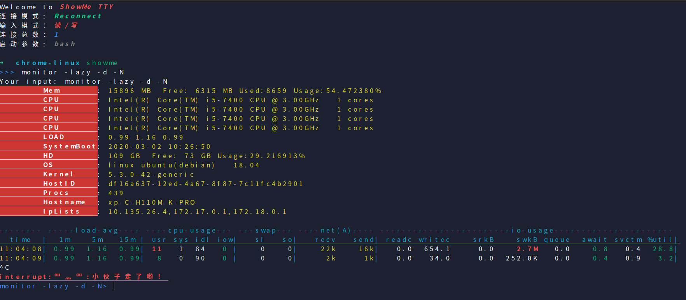

# Introduction 

 Rapid diagnostic system status tool (performance monitoring, network scanning, mysql performance monitoring, kubectl status)

> 快速诊断系统状态工具（性能监控、网络扫描、mysql性能监控）

# 环境准备

```
go get github.com/jteeuwen/go-bindata/...
go get github.com/elazarl/go-bindata-assetfs/...
```

# Usage

tags:

- tty

> showme tty 是基于web的Terminal工具

`安装`

```
git clone https://github.com/lflxp/showme
make install
showme -h
```

`使用`

```
showme tty [flags] [command] [args]
eg: showme tty -w -r showme proxy http

Usage:
  showme tty [flags]

Flags:
  -a, --audit             is audit
  -d, --debug             debug log mode
  -h, --help              help for tty
  -m, --maxconnect int    max connect number
  -p, --password string   BasicAuth 密码
  -P, --port string       http port (default "8080")
  -r, --reconnect         is auto reconnect
  -u, --username string   BasicAuth 用户名
  -w, --write             is permit writ
```

`注意`

用systemctl进行部署的时候会报`TERM environment variable not set`，这个需要在service文件里面指定环境变量`TERM=xterm-256color`

```
root@8.8.8.8:/etc/systemd/system# cat showme.service 
[Unit]
Description=showme
After=syslog.target
After=network.target

[Service]
# Modify these two values and uncomment them if you have
# repos with lots of files and get an HTTP error 500 because
# of that
###
#LimitMEMLOCK=infinity
#LimitNOFILE=65535
Type=simple
User=root
Group=root
WorkingDirectory=/tls
ExecStart=/usr/bin/showme tty -P 9999 -w -a -t -f -m 10 -u $user -p $pwd -c /tls/server.crt -k /tls/server.key
# ExecReload=/bin/kill -s HUP $MAINPID
Restart=always
Environment=USER=root HOME=/opt TERM=xterm-256color

[Install]
WantedBy=multi-user.target
```



- gopacket

```
go get github.com/lflxp/showme
go run main.go
go build -tags=gopacket main.go
```

# Operation

1. 命令提示

- tty args...
- monitor args...
- dashboard args...
- gocui active
- gopacket args...
- httpstatic
- proxy
  * http proxy
  * https reverse proxy
  * socket5 proxy
  * mysql proxy
  * shadowsocks-local & shadowsocks-server


2. monitor 监控展示


- {Text: "-L", Description: "Print to Logfile. (default \"none\")"}
- {Text: "-c", Description: "打印Cpu 信息负载信息"}
- {Text: "-d", Description: "打印Disk info (default \"none\")"}
- {Text: "-i", Description: "STRING 时间间隔 默认1秒 (default \"1\")"}
- {Text: "-l", Description: "打印Load 信息"}
- {Text: "-lazy", Description: "Print Info  (include -t,-l,-c,-s,-n)."}
- {Text: "-n", Description: "打印net网络流量"}
- {Text: "-N", Description: "打印net网络详细流量"}
- {Text: "-s", Description: "打印swap 信息"}
- {Text: "-t", Description: "打印当前时间"}

3. scan ip and port


- Tab: Next View
- Enter: Select IP/Commit Input
- F5: Input New Scan IP or Port range
- ↑ ↓: Move View
- ^c: Exit
- F1: Help
- Space: search result with ip view and port view

4. static http server

static功能主要是快速启动一个http服务进行文件的传输，包括文件上传和下载，拜托无工具可用的尴尬境地。

目前static新增了视频模式，通过过滤常用的视频文件格式在前端通过video标签进行直接播放，本地离线视频服务。

> showme static -h

```
通过本地http服务进行简单的文件传输和文件展示

Usage:
  showme static [flags]

Flags:
  -h, --help           help for static
  -c, --pagesize int   每页显示视频数 (default 20)
  -f, --path string    加载目录 (default "./")
  -p, --port string    服务端口 (default "9090")
  -t, --types string   过滤视频类型，多个用逗号隔开 (default ".avi,.wma,.rmvb,.rm,.mp4,.mov,.3gp,.mpeg,.mpg,.mpe,.m4v,.mkv,.flv,.vob,.wmv,.asf,.asx")
  -v, --video          是否切换为视频模式

Global Flags:
      --config string   config file (default is $HOME/.showme.yaml)
```      

- port: static http port, default: 9090

5. gopacket 网络流量监控

command: 
- gopacket interface eth0
- gopacket screen eth0

> TIPS: 条件编译，需要该功能需要在build的指定tags
> eg: go build -tags=gopacket main.go

6. kubectl


feature:
- dashboard
- pod
- deployment
- service
- nodes

function:
- describe
- delete
- search
- logs

todo:
- side menu
- top five view table
- bottom one detail view
- like kubernetes dashboard

# feature

1. 非网络连接
2. 非vue类界面操作
3. 速度
4. 本地性能、监控、操作
5. 快速定位
6. command visio
7. 网络监听（原始报文解析和展示）
8. web terminial
9. 快速文件传输

# functions

1. go-prompt
2. gocui/tcell/tview/ncurses/goncurses
3. 提示选项分为两种： 一、命令参数 dashboard status 二、配置参数 dashboard --status
4. github.com/jroimartin/gocui
5. github.com/gdamore/tcell

# 新增操作

0. suggests/commands.go 添加首字符命令添加提示
1. completers/options.go 添加含【-】的参数
2. completers/common.go -> FirstCommandFunc 添加命令提示 添加基于首字符的二级字符命令提示
3. executors 添加目录实现命令gocui展示
4. executors/executors.go 添加command对应的执行命令

# 多线程改造

https://blog.csdn.net/lengyuezuixue/article/details/79664409

# todo

- mysql 解析
- 微服务管理和功能测试
- 日志系统 @[logrus](https://github.com/sirupsen/logrus)
- 修复自动刷新全部跳转到deployment的错误
- 添加pod和deployment手动刷新数据的错误
- 考虑是否取消自动刷新的功能或者优化自动查询效率
- web terminial 前端界面优化
- 结合GuiLite进行美化
- tty 添加install自动部署systemctl服务的功能

# k8s resource list

```
alertmanagers.monitoring.coreos.com                           endpoints                                                     nodes.metrics.k8s.io                                          replicasets.extensions
apiservices.apiregistration.k8s.io                            etcdclusters.etcd.database.coreos.com                         persistentvolumeclaims                                        replicationcontrollers
certificatesigningrequests.certificates.k8s.io                events                                                        persistentvolumes                                             resourcequotas
clusterrolebindings.rbac.authorization.k8s.io                 events.events.k8s.io                                          poddisruptionbudgets.policy                                   rolebindings.rbac.authorization.k8s.io
clusterroles.rbac.authorization.k8s.io                        horizontalpodautoscalers.autoscaling                          pods                                                          roles.rbac.authorization.k8s.io
componentstatuses                                             ingresses.extensions                                          pods.metrics.k8s.io                                           secrets
configmaps                                                    jobs.batch                                                    podsecuritypolicies.extensions                                serviceaccounts
controllerrevisions.apps                                      leases.coordination.k8s.io                                    podsecuritypolicies.policy                                    servicemonitors.monitoring.coreos.com
cronjobs.batch                                                limitranges                                                   podtemplates                                                  services
customresourcedefinitions.apiextensions.k8s.io                mutatingwebhookconfigurations.admissionregistration.k8s.io    priorityclasses.scheduling.k8s.io                             statefulsets.apps
daemonsets.apps                                               namespaces                                                    prometheuses.monitoring.coreos.com                            storageclasses.storage.k8s.io
daemonsets.extensions                                         networkpolicies.extensions                                    prometheusrules.monitoring.coreos.com                         validatingwebhookconfigurations.admissionregistration.k8s.io
deployments.apps                                              networkpolicies.networking.k8s.io                             redisfailovers.storage.spotahome.com                          volumeattachments.storage.k8s.io
deployments.extensions                                        nodes                                                         replicasets.apps                                              
```
