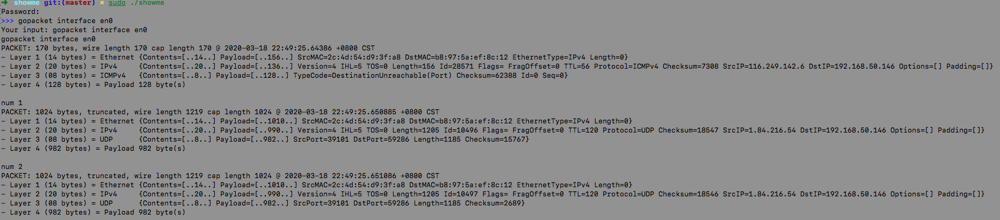

gopacket 网络流量监控

```
implement by https://gitee.com/lflxp/webMonitor/tree/master/decoder/http
using gopacket
study gocui by github.com/miguelmota/cointop
```



## Install

```
go get github.com/lflxp/showme
go run main.go
go build -tags=gopacket main.go
```

`TIPS`: 条件编译，需要该功能需要在build的指定tags

## Usage

> gopacket [command] [interface]

- gopacket interface eth0
- gopacket screen eth0

## 查询结果

```bash
➜  showme git:(master) ✗ sudo ./showme 
Password:
>>> gopacket interface en0
Your input: gopacket interface en0
gopacket interface en0
PACKET: 170 bytes, wire length 170 cap length 170 @ 2020-03-18 22:49:25.64386 +0800 CST
- Layer 1 (14 bytes) = Ethernet	{Contents=[..14..] Payload=[..156..] SrcMAC=2c:4d:54:d9:3f:a8 DstMAC=b8:97:5a:ef:8c:12 EthernetType=IPv4 Length=0}
- Layer 2 (20 bytes) = IPv4	{Contents=[..20..] Payload=[..136..] Version=4 IHL=5 TOS=0 Length=156 Id=28571 Flags= FragOffset=0 TTL=56 Protocol=ICMPv4 Checksum=7308 SrcIP=116.249.142.6 DstIP=192.168.50.146 Options=[] Padding=[]}
- Layer 3 (08 bytes) = ICMPv4	{Contents=[..8..] Payload=[..128..] TypeCode=DestinationUnreachable(Port) Checksum=62388 Id=0 Seq=0}
- Layer 4 (128 bytes) = Payload	128 byte(s)

num 1
PACKET: 1024 bytes, truncated, wire length 1219 cap length 1024 @ 2020-03-18 22:49:25.650885 +0800 CST
- Layer 1 (14 bytes) = Ethernet	{Contents=[..14..] Payload=[..1010..] SrcMAC=2c:4d:54:d9:3f:a8 DstMAC=b8:97:5a:ef:8c:12 EthernetType=IPv4 Length=0}
- Layer 2 (20 bytes) = IPv4	{Contents=[..20..] Payload=[..990..] Version=4 IHL=5 TOS=0 Length=1205 Id=10496 Flags= FragOffset=0 TTL=120 Protocol=UDP Checksum=18547 SrcIP=1.84.216.54 DstIP=192.168.50.146 Options=[] Padding=[]}
- Layer 3 (08 bytes) = UDP	{Contents=[..8..] Payload=[..982..] SrcPort=39101 DstPort=59286 Length=1185 Checksum=15767}
- Layer 4 (982 bytes) = Payload	982 byte(s)

num 2
PACKET: 1024 bytes, truncated, wire length 1219 cap length 1024 @ 2020-03-18 22:49:25.651086 +0800 CST
- Layer 1 (14 bytes) = Ethernet	{Contents=[..14..] Payload=[..1010..] SrcMAC=2c:4d:54:d9:3f:a8 DstMAC=b8:97:5a:ef:8c:12 EthernetType=IPv4 Length=0}
- Layer 2 (20 bytes) = IPv4	{Contents=[..20..] Payload=[..990..] Version=4 IHL=5 TOS=0 Length=1205 Id=10497 Flags= FragOffset=0 TTL=120 Protocol=UDP Checksum=18546 SrcIP=1.84.216.54 DstIP=192.168.50.146 Options=[] Padding=[]}
- Layer 3 (08 bytes) = UDP	{Contents=[..8..] Payload=[..982..] SrcPort=39101 DstPort=59286 Length=1185 Checksum=2689}
- Layer 4 (982 bytes) = Payload	982 byte(s)
```