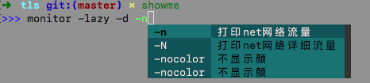
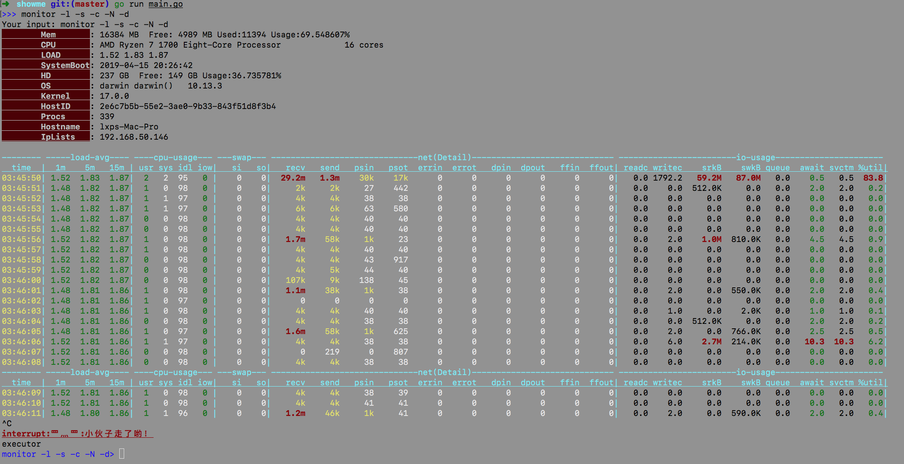

monitor Linux主机实时性能分析模块，提供多维数据汇总展示




## 特点

* Dashboard
* 负载情况
* CPU负载情况
* Swap情况
* Disk IO
* Net IO

## Usage

monitor是showme终端GUI显示，提供动态参数提示功能。

```bash
➜  tls git:(master) ✗ showme
>>> monitor -lazy -d -n -s
```

## 参数

- {Text: "-L", Description: "Print to Logfile. (default \"none\")"}
- {Text: "-c", Description: "打印Cpu 信息负载信息"}
- {Text: "-d", Description: "打印Disk info (default \"none\")"}
- {Text: "-i", Description: "STRING 时间间隔 默认1秒 (default \"1\")"}
- {Text: "-l", Description: "打印Load 信息"}
- {Text: "-lazy", Description: "Print Info  (include -t,-l,-c,-s,-n)."}
- {Text: "-n", Description: "打印net网络流量"}
- {Text: "-N", Description: "打印net网络详细流量"}
- {Text: "-s", Description: "打印swap 信息"}
- {Text: "-t", Description: "打印当前时间"}

# TODO


1. Host  IP
2. CPU/MEM/DISK
3. time load-avg cpu-usage swap
4. -n eth0
5. second by second